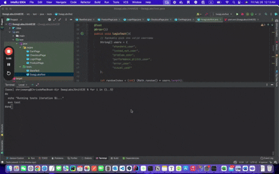

# SwagLabsJUnitE2E (JUnit version)

This is a sample end-to-end automated test project using **Java + Maven + Selenium + JUnit** for the Swag Labs website.

## Demo GIF



## Prerequisites
- Java 17+ installed
- Maven 3+ installed
- Chrome Browser installed (latest recommended)


## How to run
1. Clone the project:
   ```bash
   git clone https://github.com/<your_account>/SwagLabsJUnitE2E.git

2. Go to the project folder and run
   ```bash
   mvn test

3. Tests will run automatically in a Chrome browser, and JUnit results will appear in the console.


### Overview

- `pages`: Page Object Model classes for Login, Products, Cart, Checkout.
- `tests`: 
   - `BaseTest.java`: The base class that manages WebDriver initialization and teardown. All other test classes can extend this to reuse the setup.
   - `SwagLabsTest.java`: The main test class running the end-to-end flow (login, add random items, checkout).
- `pom.xml`: Maven build file.
- JUnit: Testing framework to organize and run tests.
- Selenium: Automates browser actions (click, type, etc.).
- WebDriverManager: Automatically handles the browser driver binaries.
- Page Object Model: Each page has its own class encapsulating elements and actions, making the code more maintainable.


### Notes on Different Swag Labs Users

Swag Labs provides several built-in user accounts for testing, each with unique behaviors:

- `standard_user`: Can successfully login, add items, and checkout.
- `locked_out_user`: Fails to login with error "Epic sadface: Sorry, this user has been locked out."
- `problem_user`: Some items can’t be removed or added properly; checkout fields may behave unexpectedly.
- `performance_glitch_user`: Login and page transitions may be delayed.
- `error_user`: Certain fields can’t be filled out; cannot complete checkout successfully.
- `visual_user`: UI elements may appear in different places, but otherwise works.

The main test script randomly picks among these users. If it picks a problematic user (`locked_out_user`), the test may fail as expected due to the user’s built-in limitations.
